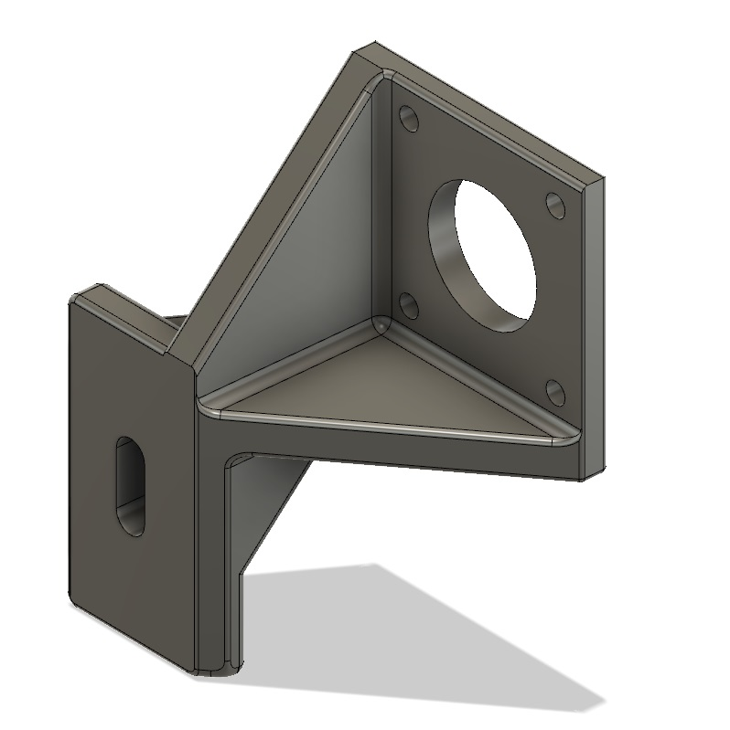
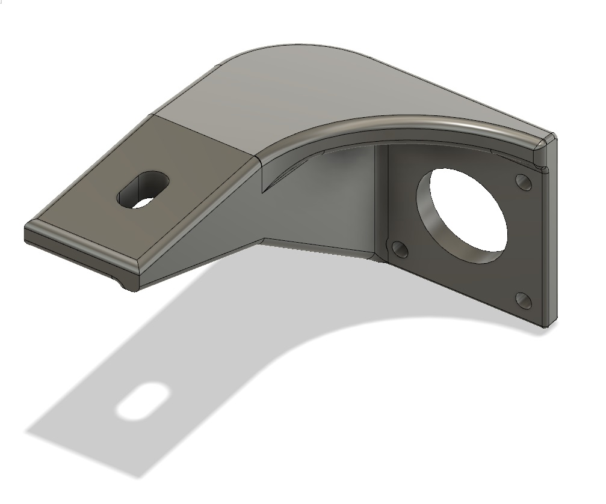
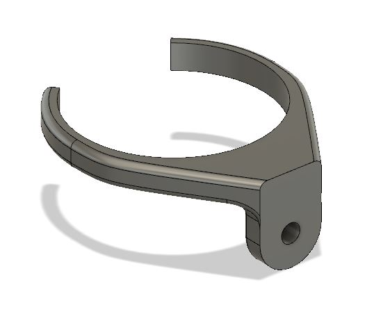

# SkywatcherEq3-CadFiles

These are CAD files to adapt NEMA17 motors to the Skywatcher EQ3 telescope mount.
Especially designed for QMOT QSH4218 motors.

The files were designed in Fusion 360 for a Polytech Tours School project.

